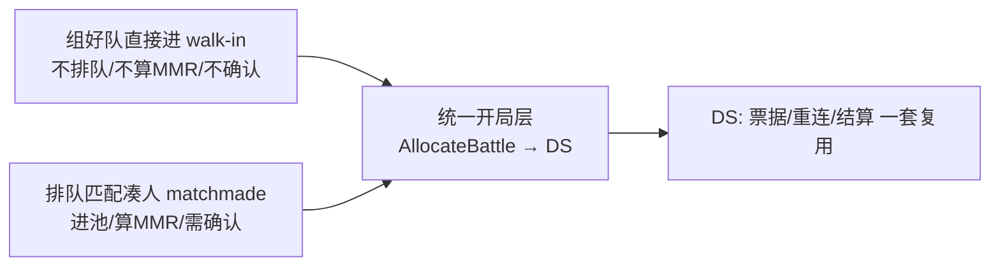

# 决策:进本入口模式——直接进(walk-in)与匹配进(matchmade)分离,统一到开局层

> 决策级别:玩法接入架构(跨 客户端 / matchmaker / ds_allocator)。
> 触发:讨论「PVE 副本是匹配一个队伍就能进,还是不匹配直接进战斗?两种要不要混在一起?大厂标准做法是什么?」
> 日期:2026-07-07。状态:**已拍板——入口分离、开局层合并;PVP 走匹配、PVE 走直接进,配置切换,零新代码**。
> 关联:副本选择链路见 `Pandora-Client-SVN/Doc/服务器/副本选择_UE侧交接_Codex.md`;
> 配表分层见 `docs/design/decision-dungeon-scene-table-layering.md`;
> matchmaker 单写者/分片见 `docs/design/decision-revisit-matchmaker-single-writer.md`。

## 1. 背景与问题

已有 PVP(MobaLevel),现加 PVE 副本(SonglinTown)。map_id 全链路已打通(客户端选副本 →
matchmaker 透传 → ds_allocator 按 map_id 起图/传 label)。剩下的玩法问题:

- 进副本到底是「匹配一个队伍才进」还是「不匹配直接进战斗」?
- 这两种要不要混在同一条链路/同一个撮合池里?
- 大厂标准做法是什么?

## 2. 澄清:服务端现状已有两条路(配置开关)

matchmaker 侧已存在两种成局方式,由 `walk_in` 决定
(见 `services/matchmaking/matchmaker/etc/matchmaker-dev.yaml`):

| 模式 | 配置 | 行为 |
|---|---|---|
| **撮合模式(matchmade)** | `walk_in: false` | 一张票(单人/整队)**不够**开局,要凑满 `2×team_size` 人(A/B 两边对战结构)+ 全员确认(confirm)才拉 DS。这是 PVP 的正路。 |
| **即时开局(walk-in / instant-start)** | `walk_in: true` | 每张票**立即成局、跳过确认、直接 AllocateBattle 拉 DS**。这就是「不匹配直接进」。代码路径为 `formSoloMatch`(biz/match.go)。 |

> **命名债已还(2026-07-25)**:原键名 `enable_solo_match` 注释写的是「本地端到端测试专用」,
> 但其语义本质是「入口是否撮合」,且它正是 PVE 的生产开关 —— 已正名为 **`walk_in`**(§5 的建议落地)。
> 兼容契约(§9.21 expand→migrate→contract,当前处于 **migrate**):`conf.Defaults()` 仍读旧键并
> **OR 并入** `walk_in`(漏迁移的部署若被静默判 false,PVE 会退化成「等对手撮合」而 PVE 无单边成局
> 逻辑,玩家永远等不到人),启动时打 `deprecated_config_key` Warn;线上不再出现该 Warn 后,才可进入
> contract 阶段删除 `EnableSoloMatch` 字段及其兼容测试。
> **未改**:`formSoloMatch` 函数名与 `solo_match_found` 日志键 —— 日志键是可观测性契约(被
> `docs/incidents/2026-07-24-p0-matchmaker-orphan-start-claim-freeze.md` 时间线当证据引用),不做无谓 churn。

结论:**「直接进副本」不是要新写的功能,代码已存在**,只是当前当 dev 开关用、尚未作为正式 PVE 入口部署。

## 3. 大厂标准做法:入口分离,开局层合并

主流引擎/大厂(Open Match + Agones director 模式、WoW、FF14、Destiny)都是同一结构:

两条**入口**不混池:
- **直接进**:不进撮合池、不算 MMR、不需要 confirm;组好队(或单人)即开局。
  例:WoW 走副本门直接进、Destiny 火力战队直接启动。
- **匹配进**:进撮合池、按 MMR/region 凑人、需要 confirm。
  例:WoW 随机地下城 LFD、Destiny 突袭匹配。

但两条入口**汇到同一开局层**:DS 分配、DSTicket 签发、断线重连、战斗结算全复用一套。
理由:美术做一张地图/一套 DS 流程成本极高,不该为每种入口各写一遍;差异只在「要不要撮合」,
那一层薄薄地分叉即可,下游全共享。

我们当前架构正是这个形状——`ds_allocator.AllocateBattle` 就是统一开局层,matchmaker 只是它的一个调用方;
`walk_in` 就是「入口是否撮合」的分叉开关。

## 4. 拍板结论

**入口分离、开局层合并。** 落到既定「一个 game_mode 一个 matchmaker 部署」的部署模型:

- **PVP 部署**:`walk_in: false`,照旧撮合(凑对手 + confirm)。
- **PVE 部署**:`walk_in: true` + `game_mode: "pve_coop"`,单人/整队带 `map_id`
  **直接开局**,天然避开跨副本混桌。**零新代码,配置即得。**

不要把「直接进」和「匹配进」塞进同一撮合池用条件分支硬切——按 game_mode 分部署,
入口差异用配置开关表达,下游开局层不感知入口类型。

## 4.1 修订(2026-08-11):PVE 两个入口共存,人数改上下限

原决策把入口当成**图的属性**(一张图只有一种进法)。实际玩法要求是:同一张 PVE 副本
**既能排队撮合凑满人,也能人不够时自己进**,由玩家二选一。这不是图的属性,是玩家的选择。

落地(细节见 [`matchmaker/README.md`](../../services/matchmaking/matchmaker/README.md)
「同一张图两个入口」):

- 关卡表 `entry_mode` 新增取值 `BOTH=3`,语义从「怎么进」改为「**允许**怎么进」;
  `StartMatchRequest.entry_mode` 承载玩家这一次的**选择**(§17.2 允许传选择)。
  服务端求交并 fail-closed:表填 `BOTH` 而请求没选 → 拒 `4010`,**不替玩家猜入口**。
- 关卡表新增 `min_team_size`(队伍人数下限),**只对直进生效**:5 人本最少 3 人才准自己进,
  不足拒 `4009`。`team_size` 语义澄清为「撮合的凑齐目标 / 直进的上限」。
- **撮合不做超时放宽**:凑不满就继续等,「等不及」由玩家改点直进表达。少一套放宽状态机(§15.3)。
- **PVP 一行不动**:`entry_mode` 保持 `MATCHMAKE`、不填下限,装箱仍要求每方恰好坐满
  (降下限会变成 3v2,那是不公平不是灵活;PVP 缺人应走 bot 或不开局)。

**未推翻的部分**:§3 / §4 的「入口分离、开局层合并」仍然成立 —— 变的是入口有几个、由谁决定,
`AllocateBattle` 统一开局层与下游(签票 / 重连 / 结算)照旧共享一套。

## 5. 明确不做 / 后续增强

- ~~**PVE 匹配补人(matchmade co-op)**:当前**不做**。~~ **已落地(2026-08-11,见 §4.1)**:
  PVE 撮合走既有 `greedyFormMatches` + `binPack`,`side_count=1` 即装一个容量 `team_size` 的箱子,
  「3 人队 + 2 个散排凑成一局」天然支持(凑局单位本就是**人数**不是票数),无需新的单边成局路径。
- **机器人补位**:仍**不做**。要做时的边界已经想清楚:bot 补的是 `[实到真人数, team_size]` 的缺口,
  **在 DS 侧补**(DS 已从 `AllocateBattle` 拿到 `map_id` 与 roster,自己那份关卡表也读得到上限,
  缺口自算),后端 proto 大概率零改动。**红线:bot 绝不能有 `player_id`、不得进 match members /
  roster / claim** —— 那份名单是真人归属的权威(一人一队列 claim、`owner_epoch`、DSTicket 全按
  `player_id` 走),给 bot 造假 ID 会一路污染 locator、battle_result 结算与掉落入包。
  连带需检查:`exp_share_mode=TEAM_SHARE` 的「本场在册玩家」必须排除 bot。
- ~~**`enable_solo_match` 正名**:建议后续改为 `instant_start`(或 `walk_in`)并更新注释,消除「测试专用」误解。~~
  **已完成(2026-07-25)**:正名为 `walk_in`,注释改写为「入口是否撮合」语义并点明 PVE 生产用途;
  旧键保留兼容 + 启动 Warn,详见 §2 的兼容契约。

## 6. 待办(落地 PVE 入口)

- [x] 新增 PVE matchmaker 部署配置(`matchmaker-pve.yaml`:`game_mode: "pve_coop"` + `walk_in: true`)。
- [ ] 客户端 PVE 入口路由到 PVE matchmaker,请求带所选 `map_id`。
- [ ] UE 侧 DS 读 map_id → g_关卡.xlsx → ServerTravel(见 `副本选择_UE侧交接_Codex.md`)。
